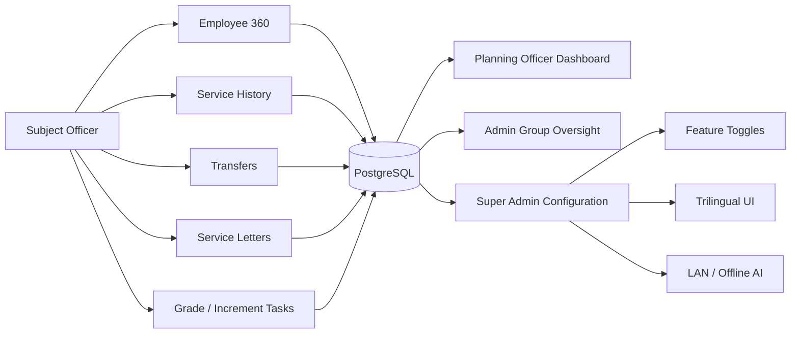
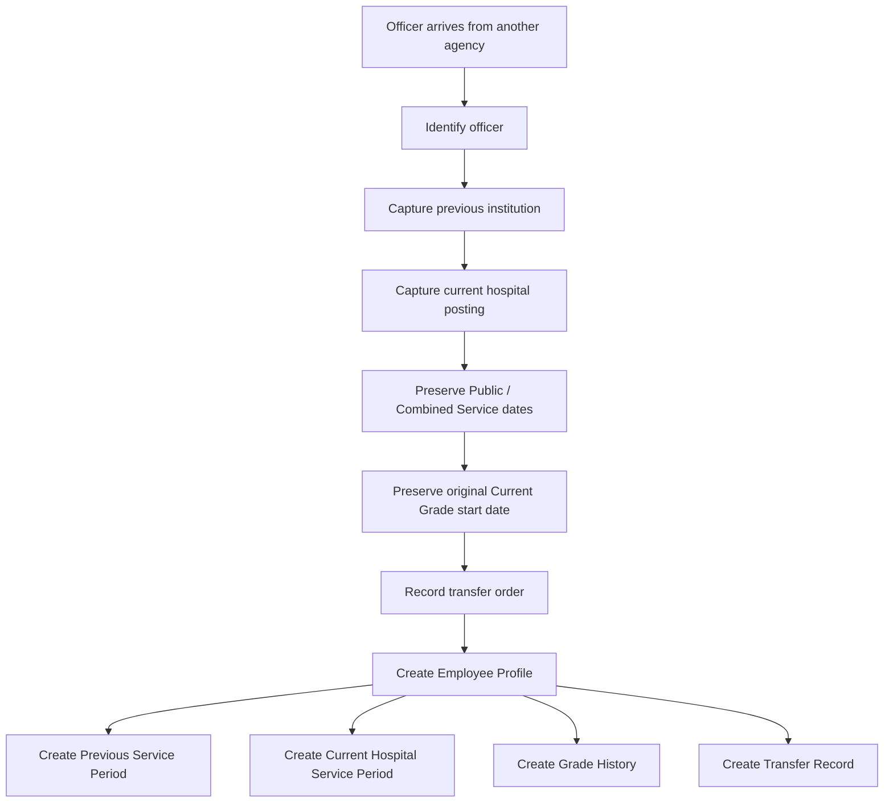
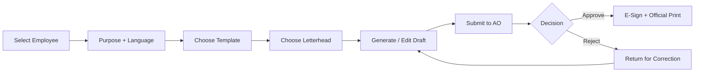
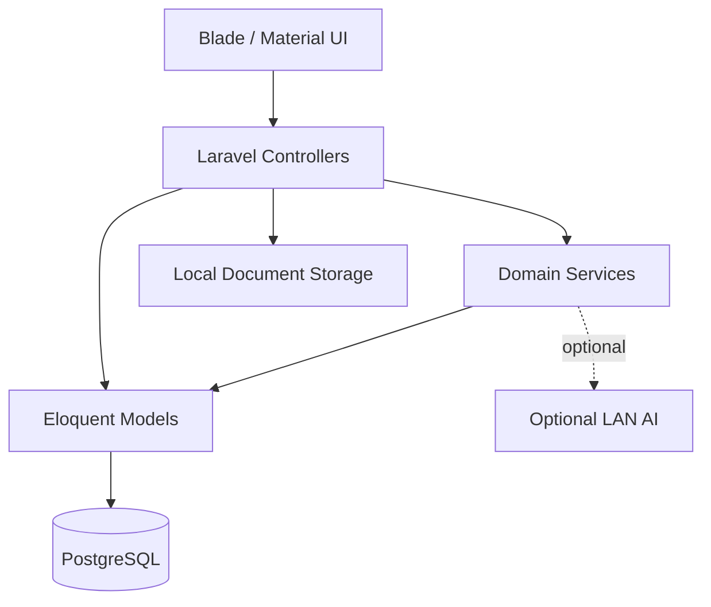

# HIMS PARIKSHA — Carder Management System

<div align="center">

# 🏥 Carder Management System

### Workforce, Cadre, Employee-Service & Administrative Workflow Management  
**Teaching Hospital Peradeniya · HIMS PARIKSHA**


**A role-based hospital workforce platform for cadre planning, employee service history, transfers, grade progression, retirement planning, service letters, data quality and administrative intelligence.**

</div>

---

## ✨ What this system does

Carder Management is a Laravel-based workforce and cadre-management platform designed for a Sri Lankan public-sector hospital environment.

It brings together:

- approved cadre and monthly workforce reporting
- Employee 360 profiles
- Subject Officer work allocation
- Combined Service and cross-agency service history
- incoming and outgoing officer workflows
- transfer and acting-appointment management
- grade progression and increment monitoring
- retirement planning
- service-letter generation, review, approval and letterheads
- trilingual UI support
- configurable feature toggles
- privacy-conscious local/offline AI assistance
- data-quality, reconciliation and workforce-planning dashboards

---

## 🧭 System at a glance



---

## 👥 Role experience

| Role | Main responsibility | Typical workspace |
|---|---|---|
| **Super Admin** | Full configuration, users, security, features, master data | Administration + all modules |
| **Planning Officer** | Institution-wide workforce planning and cadre oversight | Planning Dashboard |
| **Admin Group** | Senior-management review, approvals and aggregate oversight | Reports / approvals |
| **Subject Officer** | Day-to-day employee HR record maintenance for allocated employees | **Today & My Work** |

### Subject Officer visibility model

Subject Officers do **not** automatically see every employee under a position.

Employee-level access is controlled by explicit HR allocation:

```text
Position responsibility
        ↓
Employee HR Allocation
        ↓
Subject Officer sees only assigned Employee Profiles
```

This supports shared positions where multiple Subject Officers divide responsibility for employees.

---

# 🎯 Officer Experience vNext

The current update focuses on making the system easier to use for officers with limited ICT experience while preserving Sri Lankan public-service chronology.

## 1. 🏠 Today & My Work

The Subject Officer home screen prioritises actionable work instead of exposing a large technical menu.

Typical priorities include:

- grade promotions due or approaching
- increments due / overdue
- retirement preparation
- professional-registration expiry
- incomplete service histories
- pending employee corrections
- returned service letters
- data-quality issues
- recent employee movements
- officer workload

---

## 2. 👤 Guided Employee Profile

A simplified step-by-step employee-registration flow:

```text
👤 Person
   ↓
💼 Position
   ↓
🏥 Workplace
   ↓
📅 Service Dates
   ↓
🎖 Career Continuity
   ↓
✅ Review & Save
```

The detailed Employee Profile remains available for advanced editing.

---

## 3. 🏛 Incoming Officer Workflow

Designed for officers such as **Development Officers and other Combined Service officers** transferring from another government institution.



### Important principle

**Joining this hospital does not restart the officer's public service or current-grade service.**

The system records these independently:

| Date | Meaning |
|---|---|
| Date Joined Public Service | Overall government service continuity |
| Date Joined Combined Service | Combined Service continuity, where applicable |
| Current Grade Start Date | Used for grade-progression calculations |
| Date Reported for Duty to this Institute | Hospital-specific posting date |

---

## 4. 📂 Structured Service History

Each Employee 360 profile can contain multiple service/posting periods.

A service period can capture:

- institution
- ministry / department
- service
- position
- grade
- start and end dates
- movement type
- transfer/order reference
- evidence document
- verification status
- whether the period counts toward:
  - service
  - grade service
  - pension

### Example

```text
2021 ───────────────────────── 2025
District Secretariat
Development Officer — Grade II
        │
        │ Transfer
        ▼
2026 ───────────────────────── Present
Teaching Hospital Peradeniya
Development Officer — Grade II
```

The employee's grade-service continuity remains based on the original grade-effective date.

---

## 5. 🎖 Grade Progression

Grade History is the authoritative source for promotion eligibility.

```text
Current Grade Effective Date
          +
Configured Minimum Years in Grade
          ↓
Promotion Eligibility Date
          ↓
Subject Officer Reminder / Planning Signal
```

The calculation is **not** reset when the employee transfers to the hospital.

---

## 6. 🔄 Transfer Management

Supported movement categories include:

- Internal Unit Transfer
- Internal Institutional Transfer
- Incoming External Transfer
- Outgoing External Transfer
- Temporary Attachment
- Permanent Release
- Secondment
- Deputation
- Reversion
- Inter-Ministry Transfer
- Inter-Department Transfer
- Provincial ↔ Central Service Movement
- Promotion / Grade Change
- Appointment
- Other

Transfer forms require a review confirmation before submission.

---

# ✉️ Service Letter Workflow

The service-letter module now provides a guided workflow with configurable official letterheads.



## Letterhead configuration

Super Admin can configure:

- institution name
- ministry / department
- address
- telephone / fax
- email / website
- reference prefix
- signatory designation
- header note
- footer note
- logo / emblem image
- default letterhead

Approved letters can be printed in an A4-friendly official layout.

---

# 🌐 Trilingual Interface

The interface framework supports:

- **English**
- **සිංහල**
- **தமிழ்**

Language preference can be saved per user.

Current trilingual support is implemented as an expandable Laravel language-file framework so additional screens can be translated progressively without duplicating views.

---

# 🎛 Feature Management

Super Admin can turn optional modules on or off without removing code.

Current feature groups include:

| Feature | Toggle |
|---|:---:|
| Service Letters + Letterheads | ✅ |
| Trilingual UI | ✅ |
| Service History / Combined Service | ✅ |
| Grade Progression | ✅ |
| AI Record Assistant | ✅ |
| AI Service Letter Assistant | ✅ |

Disabled modules are hidden from navigation and protected at route level where applicable.

---

# ✨ AI Assistance

The AI layer is **advisory only**.

It does not make HR decisions, approve promotions, alter service history or automatically issue official letters.

## AI Record Assistant

Provides a concise employee-record summary using available structured facts.

Typical output highlights:

- current position
- grade
- grade-effective date
- public-service start
- hospital reporting date
- service-history completeness
- missing chronology fields

## AI Service Letter Assistant

Supports drafting from verified Employee Profile information.

### Privacy-first design

```text
No configured AI endpoint
        ↓
Deterministic Offline Assistant

OR

Private LAN endpoint configured
        ↓
Local AI Model
        ↓
Draft only
        ↓
Human review remains mandatory
```

Only private/LAN endpoints are accepted by the local AI integration.

---

# 📊 Planning Officer Dashboard

Planning Officer views are designed around institution-wide workforce movement and forward pressure.

### Core signals

| Signal | Purpose |
|---|---|
| Incoming this year | Workforce arrivals |
| Outgoing this year | Workforce exits / transfers |
| Net movement | Incoming minus outgoing |
| Combined/external arrivals | Cross-agency movement |
| Outgoing next 90 days | Short-term staffing pressure |
| Retirements next 12 months | Workforce replacement planning |
| Grade progression next 12 months | Career-progression workload |

---

# 🧠 Workforce Intelligence

The broader system also includes:

- HR responsibility intelligence
- ownership history
- unassigned-position detection
- duplicate ownership warnings
- officer workload
- reassignment queue
- data-quality monitoring
- workforce forecast
- scenario comparison
- age and retirement exposure
- employee movements
- historical workforce register
- duplicate review
- bulk corrections
- application health monitoring

---

# 📋 Core modules

| Area | Main capabilities |
|---|---|
| Approved Cadre | Approved posts by position/year |
| Monthly Entries | In-position workforce submissions |
| Employee 360 | Central employee HR record |
| Service History | Multi-institution chronology |
| Transfers | Incoming, outgoing and internal movements |
| Grade History | Grade progression continuity |
| Increments | Increment workflow and reminders |
| Acting Appointments | Acting-role records |
| Retirement Project | Retirement preparation |
| Qualifications | Training / qualification history |
| Professional Registration | Registration tracking and expiry warnings |
| Service Letters | Draft → approval → e-sign → print |
| Data Quality | Missing / inconsistent record detection |
| Reports | Planning, trends, snapshots and unit breakdowns |
| Audit | Workforce and administrative audit trails |

---

# 🔐 Security & governance

The system includes:

- role-based access control
- explicit employee HR allocation
- feature middleware
- no hard-delete approach for key HR records
- audit trails
- IP allowlist support
- concurrent-session controls
- export audit logging
- offline OTP MFA support
- configurable field / workflow access
- document-based service-history verification
- local-only AI option

---

# 🧱 Technology stack

| Layer | Technology |
|---|---|
| Backend | PHP 8.2+, Laravel 10.x |
| Database | PostgreSQL 14+ |
| Frontend | Blade + Vanilla JavaScript |
| UI | Material Design-inspired interface |
| Charts / Dashboards | Server-rendered workforce analytics |
| Authentication | Laravel session authentication |
| AI | Offline deterministic assistant or optional private LAN model |
| Deployment | Hospital LAN / Linux server |

---

# 🗂 Architecture



---

# 🚀 Deployment

After pulling the current vNext branch/update:

```bash
php artisan migrate
php artisan db:seed --class=NavItemSeeder
php artisan storage:link
php artisan optimize:clear
```

`storage:link` is required for uploaded Service Letter letterhead logos.

For production deployment also ensure:

```dotenv
APP_ENV=production
APP_DEBUG=false

DB_CONNECTION=pgsql
DB_HOST=127.0.0.1
DB_PORT=5432
DB_DATABASE=carder
DB_USERNAME=...
DB_PASSWORD=...

SESSION_DRIVER=database
```

---

# 🧪 Recommended verification

After deployment, validate these workflows:

1. Subject Officer only sees explicitly allocated employees.
2. Register an incoming Development Officer with:
   - Public Service start in 2021
   - Grade II start in 2021
   - Hospital reporting date in 2026
3. Confirm Employee 360 shows both previous and current service periods.
4. Confirm promotion calculations continue from the **2021 grade-effective date**, not 2026.
5. Generate a Service Letter with an institutional letterhead.
6. Submit to Administrative Officer.
7. Approve, e-sign and print.
8. Switch interface between English / Sinhala / Tamil.
9. Disable a feature in Feature Management and confirm its navigation entry disappears.
10. Test AI with no LAN endpoint configured and confirm the offline assistant still works.

---

# 📚 Project documentation

| Document | Purpose |
|---|---|
| [INSTALLATION.md](INSTALLATION.md) | Installation and server setup |
| [SRI_LANKA_OFFICER_WORKFLOW_UPDATE.md](SRI_LANKA_OFFICER_WORKFLOW_UPDATE.md) | Sri Lankan officer workflow implementation |
| [OFFICER_EXPERIENCE_VNEXT_STATUS.md](OFFICER_EXPERIENCE_VNEXT_STATUS.md) | vNext feature status |

---

# 🧩 Design principles

> **Self-explanatory before feature-dense.**

The UI is being progressively designed so that an officer should understand what to do from the screen itself, without needing technical training.

Key principles:

- task-oriented navigation
- clear action language
- guided workflows
- review screens before irreversible actions
- preserve entered data after validation errors
- avoid exposing unnecessary technical fields
- separate historic facts from current hospital data
- explicit evidence and verification state
- no AI-generated fact should bypass human review

---

<div align="center">

### HIMS PARIKSHA — Carder Management System

**Workforce continuity · Administrative clarity · Better planning**

Teaching Hospital Peradeniya

</div>


---

# ⚖ Governance & Official Authority

Carder Management is an **internal administrative and decision-support system**. It does not create, replace or interpret Government of Sri Lanka policy or other official authority.

System-generated calculations, forecasts, alerts, recommendations, AI-assisted content, workflow configurations and reports must be verified against the applicable authoritative source before administrative action.

The Governance module records:

- institutional system ownership and decision authority
- data-controller designation/status
- technical-maintenance responsibility
- disclaimer/version information
- a **Business Rule Register**
- official source/reference for configured rules
- effective/review dates
- institutional approver and approval reference
- whether a rule is Draft, Institutional, Source-Verified or Advisory

A rule is not treated as source-verified merely because it exists in the software. The institution must record and approve the relevant source/reference.

Where system output conflicts with an applicable Act, regulation, Establishments Code provision, Public Administration circular, Ministry instruction, service minute, Public Service Commission decision or other authoritative document, **the applicable official authority takes precedence**.

AI features remain advisory-only and cannot themselves approve or determine promotions, transfers, retirement actions, disciplinary outcomes or official service certification.


## Governance implementation status

The application now includes technical governance controls for institutional ownership, source-referenced business rules, independent human approval of consequential HR actions, configuration and decision audit trails, decision-support labelling, AI capability restrictions, and report/export notices.

**Contractual / controller-processor agreement:** Pending discussion and formal review with the hospital. Carder Management does not claim that a signed development/support, controller/processor, or responsibility-allocation agreement exists until the institution and relevant parties formally approve and execute one.
