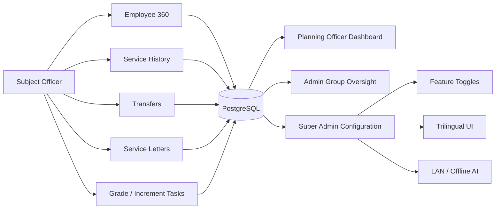
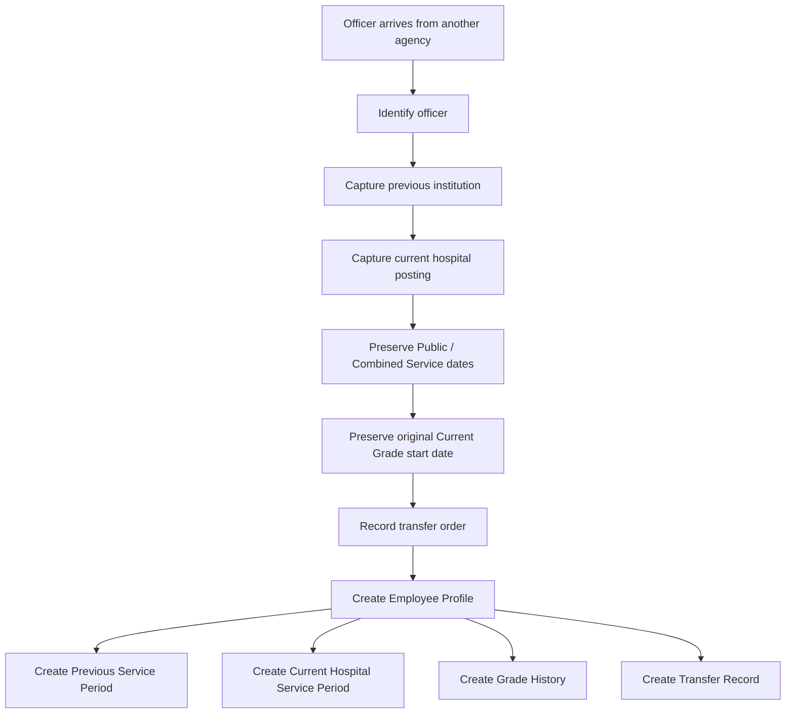
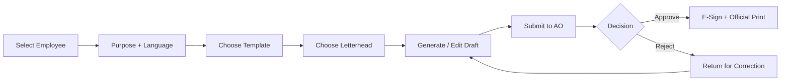
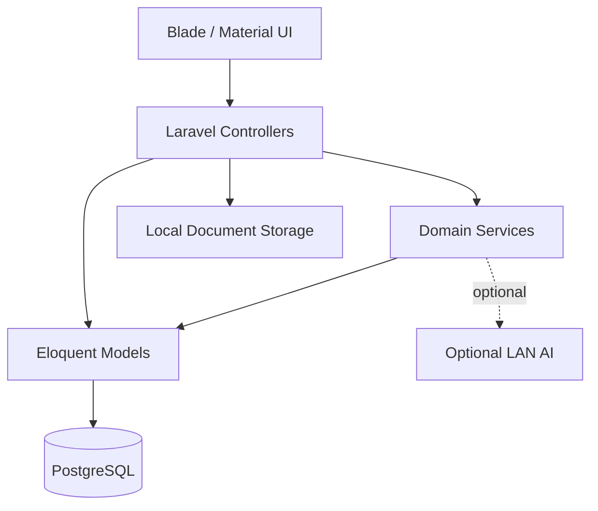

# HIMS PARIKSHA — Carder Management System

## Current source update — 3 October 2026

This repository contains the updated copy-and-replace source package, including the 1 October reference-caching update and the 2 October Guided Employee Setup fix.

- **Guided Employee Setup:** Preferred Language is now available in the Person step, with English selected by default. Sinhala and Tamil remain selectable, and the selection is retained after validation errors.
- **Reference caching:** navigation definitions, units, positions and public holidays use versioned caches. Authorization, employee PII, approvals, payroll and attendance remain live. See [caching details](NON_CRITICAL_REFERENCE_CACHING_2026-10-01.md).
- **Feature governance:** see [client versions and feature controls](CLIENT_VERSION_FEATURE_GOVERNANCE_2026-09-30.md).
- **Workforce updates:** see [phase 2](WORKFORCE_PHASE2_COMPLETION_2026-09-30.md), [phase 3](WORKFORCE_PHASE3_COMPLETION_SUMMARY_2026-09-30.md) and [roster interface updates](ROSTER_MODERNISATION_2026-09-29.md).
- **Saved Views remains available.** Removing an individual saved filter does not remove employee records.

### Installing or updating this package

The included `composer.json` targets **Laravel 10.x**. This is a copy-and-replace package, not a complete standalone Laravel skeleton: supply the base project's `bootstrap/` and writable `storage/` directories. Follow [INSTALLATION.md](INSTALLATION.md), retain your deployment `.env` and existing application key, install the locked Composer dependencies, and run the applicable migrations after backing up the database. Do not run demo seeders against production data.

After replacing the source, clear compiled views and routes:

```bash
php artisan view:clear
php artisan route:clear
```

When reference data is changed directly through SQL, run `php artisan cache:clear`; normal application edits invalidate the relevant reference cache automatically.

Database backups, deployment credentials and runtime data are not included. This synchronization was checked for diff whitespace and package consistency; PHP/Laravel runtime tests were not run in the publishing environment.

---


<div align="center">

# 🏥 Carder Management System

### Workforce, Cadre, Employee-Service & Administrative Workflow Management  
**Teaching Hospital Peradeniya · HIMS PARIKSHA**


**A role-based hospital workforce platform for cadre planning, employee service history, transfers, grade progression, retirement planning, service letters, data quality and administrative intelligence.**

</div>

---

## ✨ What this system does

Carder Management is a Laravel-based workforce and cadre-management platform with Sri Lankan public-sector HR workflows and optional private-sector, GP and clinic workforce modules.

It brings together:

- approved cadre and monthly workforce reporting
- Employee 360 profiles
- Subject Officer work allocation
- Combined Service and cross-agency service history
- incoming and outgoing officer workflows
- transfer and acting-appointment management
- grade progression and increment monitoring
- retirement planning
- service-letter generation, review, approval and letterheads
- trilingual UI support
- configurable feature toggles
- privacy-conscious local/offline AI assistance
- data-quality, reconciliation and workforce-planning dashboards

---


## Public and private-sector support

The codebase contains both Sri Lankan public-service HR workflows and optional workforce modules for private hospitals, GP practices, clinics and commercial deployments. Availability depends on the deployment edition, feature registration, dependencies and the user's role.

| Deployment context | Capabilities represented in the source | Governance boundary |
|---|---|---|
| Public / government sector | Approved cadre, monthly staffing returns, substantive appointments, Subject Officer allocations, public/Combined Service history, transfers, grades, increments, retirement and official reporting | Official source documents and institutional approval remain authoritative |
| Private hospital / GP / clinic / commercial sector | Rosters, attendance, employment contracts, leave, overtime, locum/session work, employee self-service and optional payroll/cost analysis | Modules require explicit configuration and appropriate access controls |
| Shared administration | Employee profiles, documents, training, registration expiry, dashboards, audit, security, incidents, notifications and feature governance | Access remains role- and scope-dependent |

**Current repository activation limitation:** the workforce controllers, services, routes and views are present, but the current `app/Services/FeatureToggleService.php` registry contains only the six original features. `WorkforceFeatureService` delegates to that registry; unregistered workforce features therefore resolve to disabled. The capabilities below describe source modules, not a claim that every module is currently reachable or enabled on `main`. Restoring the complete feature registry and verifying route registration/dependencies is required before deployment validation.

The supplied phase-3 documentation specifies government defaults with digital leave, biometric adapters, leave automation, contract lifecycle, locum pool, demand forecasting and roster optimization disabled unless explicitly approved. Internal payroll is documented as disabled by default and requires exceptional Super Admin enablement with an audited governance reason. See [client feature governance](CLIENT_VERSION_FEATURE_GOVERNANCE_2026-09-30.md) and [government compatibility](WORKFORCE_PHASE3_COMPLETION_SUMMARY_2026-09-30.md).

## Roster management

Roster source is organized in [routes/roster.php](routes/roster.php), roster controllers and workflow/compliance services.

| Area | Included functionality |
|---|---|
| Planning | Reusable roster templates, unit-based plans, assignments and employee availability |
| Lifecycle | Draft submission, configured approval workflow, start and completion actions |
| Calendar | Modern roster presentation and staffing-shortfall indicators |
| Coverage | Open shifts, employee claims and manager review |
| Shift changes | Two-way peer swaps, peer responses, replacement/give-away requests and approval |
| Employee access | Personal roster action centre and acknowledgement of published duties |
| Published-plan integrity | Governed amendment requests, previous-revision snapshots and revision increments |
| Compliance | Overlap checks, configured staffing minimums, skill/competency requirements and cross-unit checks |
| Optimization | Ranked employee suggestions using availability, workload, night-duty fairness and compliance signals |

Acknowledgement records receipt of a roster; it is not attendance verification. Optimizer suggestions do not publish or amend a roster automatically. See [roster modernization](ROSTER_MODERNISATION_2026-09-29.md) and [phase-2 roster workflows](WORKFORCE_PHASE2_COMPLETION_2026-09-30.md).

## Biometric integration and attendance

The attendance integration source includes device configuration, device-user-to-employee mapping, attendance event retrieval, deduplication, multi-punch daily aggregation, odd-punch exception detection and manual rebuilding of daily attendance.

| Adapter | Scope and configuration |
|---|---|
| Suprema BioStar 2 TA | Configurable REST retrieval adapter; supply the punch endpoint and authentication required by the installed BioStar/API version |
| Generic REST | Configurable event endpoint and field mappings for middleware or SDK bridges |

Integration credentials are stored using encrypted configuration. Carder stores attendance metadata rather than fingerprint, face or iris templates. Device compatibility, authentication, response shape, timezone handling and punch mapping must be tested against the actual installation; the adapter code is not a guarantee of plug-and-play compatibility with every device.

Attendance also has manual records and a correction-request/decision workflow. See [attendance integration controller](app/Http/Controllers/AttendanceIntegrationController.php), [adapter implementations](app/Services/Attendance) and [phase-3 attendance notes](WORKFORCE_PHASE3_COMPLETION_SUMMARY_2026-09-30.md).

## Additional workforce modules

| Module | Source capabilities |
|---|---|
| Leave management | Configurable leave types and balances, half-day requests, approvals and carry-forward |
| Leave automation | Effective-dated and contract-specific policies, monthly/annual accrual, annual/carry-forward caps and audited application runs |
| Overtime | Attendance/roster-linked records, configurable multiplier and approval |
| Contracts | Permanent, probation, fixed-term, part-time, hourly, locum, visiting and sessional terms |
| Contract lifecycle | Probation reviews, confirm/extend/terminate decisions, renewal approval and new effective-dated contracts preserving earlier history |
| Locum / session work | Session, hourly, per-patient, revenue-share and hybrid calculation methods |
| Locum pool | Availability and preferred rates, booking approval, draft session creation and reconciliation; external payment references |
| Employee self-service | Personal roster, attendance, leave and finalized payslip summaries, subject to enabled modules and permissions |
| Payroll | Effective-dated statutory profiles, adjustments, overtime/locum inputs and finalized-run locking; disabled by default under documented governance |
| Cost centres | Payroll, overtime, locum and employer statutory cost aggregation; depends on payroll |
| Demand forecasting | Unit/position rules and activity inputs such as visits, admissions, bed-days, theatre, clinic and lab workload; required-FTE estimates and staffing gaps |

Forecasts are advisory and do not change approved cadre. Leave automation requires governance review rather than independently determining legal entitlement. See the [workforce feature manifest](PRIVATE_WORKFORCE_FEATURE_MANIFEST_2026-09-28.md), [phase-3 summary](WORKFORCE_PHASE3_COMPLETION_SUMMARY_2026-09-30.md) and [workforce route definitions](routes/workforce.php).

## Client editions, versions and feature governance

The Client Version & Feature Manager module records client/institution, edition/plan, application version, release channel and a reason for each change. Version snapshots and audit records preserve the feature configuration history. This role is intended for deployment configuration and does not grant HR, payroll, employee PII or operational approval access.

Feature dependencies include attendance for overtime/biometrics, contracts for locum/payroll, leave for accrual automation, roster for optimization and payroll for cost-centre analysis. Disabling a feature preserves historical records. Payroll and payroll-dependent cost-centre controls are excluded from the dedicated client feature manager's scope. The current registry limitation above must be resolved before these workforce controls can be treated as operational.

## Other administrative and governance features

The repository also contains modules beyond the original employee/cadre screens:

- **Document and professional development:** employee documents, training/competency records and professional-registration expiry tracking.
- **Official reporting:** preparation/review/approval workflows and report snapshots.
- **Car passes:** application and administrative management workflows.
- **Utility bills:** operational capture and administrative management.
- **Governance:** ownership and authority records, business-rule references, workflow controls and incident/correction tracking.
- **Security:** a dedicated security console, personnel PII protections and audit controls.
- **Usability:** offline UI assets, contextual help, dashboard/history animation, chart improvements and AI usage auditing.
- **Performance:** versioned caching for non-critical reference data, with sensitive decisions and personnel data kept live.

For implementation detail, see [car passes](CAR_PASS_MANAGEMENT_UPDATE_2026_09_23.md), [utility bills](UTILITY_BILL_MANAGEMENT_UPDATE_2026_09_25.md), [security console](SUPER_ADMIN_SECURITY_CONSOLE_2026-09-28.md), [PII encryption](PERSONNEL_PII_ENCRYPTION_2026-09-26.md), [offline UI](OFFLINE_UI_UPGRADE_2026-09-24.md) and [reference caching](NON_CRITICAL_REFERENCE_CACHING_2026-10-01.md).

---

## 🧭 System at a glance


```mermaid
flowchart LR
    A[Subject Officer] --> B[Employee 360]
    A --> C[Service History]
    A --> D[Transfers]
    A --> E[Service Letters]
    A --> F[Grade / Increment Tasks]

    B --> G[(PostgreSQL)]
    C --> G
    D --> G
    E --> G
    F --> G

    G --> H[Planning Officer Dashboard]
    G --> I[Admin Group Oversight]
    G --> J[Super Admin Configuration]

    J --> K[Feature Toggles]
    J --> L[Trilingual UI]
    J --> M[LAN / Offline AI]
```

---

## 👥 Role experience

| Role | Main responsibility | Typical workspace |
|---|---|---|
| **Super Admin** | Full configuration, users, security, features, master data | Administration + all modules |
| **Planning Officer** | Institution-wide workforce planning and cadre oversight | Planning Dashboard |
| **Admin Group** | Senior-management review, approvals and aggregate oversight | Reports / approvals |
| **Subject Officer** | Day-to-day employee HR record maintenance for allocated employees | **Today & My Work** |

### Subject Officer visibility model

Subject Officers do **not** automatically see every employee under a position.

Employee-level access is controlled by explicit HR allocation:

```text
Position responsibility
        ↓
Employee HR Allocation
        ↓
Subject Officer sees only assigned Employee Profiles
```

This supports shared positions where multiple Subject Officers divide responsibility for employees.

---

# 🎯 Officer Experience vNext

The current update focuses on making the system easier to use for officers with limited ICT experience while preserving Sri Lankan public-service chronology.

## 1. 🏠 Today & My Work

The Subject Officer home screen prioritises actionable work instead of exposing a large technical menu.

Typical priorities include:

- grade promotions due or approaching
- increments due / overdue
- retirement preparation
- professional-registration expiry
- incomplete service histories
- pending employee corrections
- returned service letters
- data-quality issues
- recent employee movements
- officer workload

---

## 2. 👤 Guided Employee Profile

A simplified step-by-step employee-registration flow:

```text
👤 Person
   ↓
💼 Position
   ↓
🏥 Workplace
   ↓
📅 Service Dates
   ↓
🎖 Career Continuity
   ↓
✅ Review & Save
```

The detailed Employee Profile remains available for advanced editing.

---

## 3. 🏛 Incoming Officer Workflow

Designed for officers such as **Development Officers and other Combined Service officers** transferring from another government institution.


```mermaid
flowchart TD
    A[Officer arrives from another agency] --> B[Identify officer]
    B --> C[Capture previous institution]
    C --> D[Capture current hospital posting]
    D --> E[Preserve Public / Combined Service dates]
    E --> F[Preserve original Current Grade start date]
    F --> G[Record transfer order]
    G --> H[Create Employee Profile]
    H --> I[Create Previous Service Period]
    H --> J[Create Current Hospital Service Period]
    H --> K[Create Grade History]
    H --> L[Create Transfer Record]
```

### Important principle

**Joining this hospital does not restart the officer's public service or current-grade service.**

The system records these independently:

| Date | Meaning |
|---|---|
| Date Joined Public Service | Overall government service continuity |
| Date Joined Combined Service | Combined Service continuity, where applicable |
| Current Grade Start Date | Used for grade-progression calculations |
| Date Reported for Duty to this Institute | Hospital-specific posting date |

---

## 4. 📂 Structured Service History

Each Employee 360 profile can contain multiple service/posting periods.

A service period can capture:

- institution
- ministry / department
- service
- position
- grade
- start and end dates
- movement type
- transfer/order reference
- evidence document
- verification status
- whether the period counts toward:
  - service
  - grade service
  - pension

### Example

```text
2021 ───────────────────────── 2025
District Secretariat
Development Officer — Grade II
        │
        │ Transfer
        ▼
2026 ───────────────────────── Present
Teaching Hospital Peradeniya
Development Officer — Grade II
```

The employee's grade-service continuity remains based on the original grade-effective date.

---

## 5. 🎖 Grade Progression

Grade History is the authoritative source for promotion eligibility.

```text
Current Grade Effective Date
          +
Configured Minimum Years in Grade
          ↓
Promotion Eligibility Date
          ↓
Subject Officer Reminder / Planning Signal
```

The calculation is **not** reset when the employee transfers to the hospital.

---

## 6. 🔄 Transfer Management

Supported movement categories include:

- Internal Unit Transfer
- Internal Institutional Transfer
- Incoming External Transfer
- Outgoing External Transfer
- Temporary Attachment
- Permanent Release
- Secondment
- Deputation
- Reversion
- Inter-Ministry Transfer
- Inter-Department Transfer
- Provincial ↔ Central Service Movement
- Promotion / Grade Change
- Appointment
- Other

Transfer forms require a review confirmation before submission.

---

# ✉️ Service Letter Workflow

The service-letter module now provides a guided workflow with configurable official letterheads.


```mermaid
flowchart LR
    A[Select Employee] --> B[Purpose + Language]
    B --> C[Choose Template]
    C --> D[Choose Letterhead]
    D --> E[Generate / Edit Draft]
    E --> F[Submit to AO]
    F --> G{Decision}
    G -->|Approve| H[E-Sign + Official Print]
    G -->|Reject| I[Return for Correction]
    I --> E
```

## Letterhead configuration

Super Admin can configure:

- institution name
- ministry / department
- address
- telephone / fax
- email / website
- reference prefix
- signatory designation
- header note
- footer note
- logo / emblem image
- default letterhead

Approved letters can be printed in an A4-friendly official layout.

---

# 🌐 Trilingual Interface

The interface framework supports:

- **English**
- **සිංහල**
- **தமிழ்**

Language preference can be saved per user.

Current trilingual support is implemented as an expandable Laravel language-file framework so additional screens can be translated progressively without duplicating views.

---

# 🎛 Feature Management

Super Admin can turn optional modules on or off without removing code.

The current central feature registry contains the following original groups. Additional workforce feature source and its activation limitation are documented above:

| Feature | Toggle |
|---|:---:|
| Service Letters + Letterheads | ✅ |
| Trilingual UI | ✅ |
| Service History / Combined Service | ✅ |
| Grade Progression | ✅ |
| AI Record Assistant | ✅ |
| AI Service Letter Assistant | ✅ |

Disabled modules are hidden from navigation and protected at route level where applicable.

---

# ✨ AI Assistance

The AI layer is **advisory only**.

It does not make HR decisions, approve promotions, alter service history or automatically issue official letters.

## AI Record Assistant

Provides a concise employee-record summary using available structured facts.

Typical output highlights:

- current position
- grade
- grade-effective date
- public-service start
- hospital reporting date
- service-history completeness
- missing chronology fields

## AI Service Letter Assistant

Supports drafting from verified Employee Profile information.

### Privacy-first design

```text
No configured AI endpoint
        ↓
Deterministic Offline Assistant

OR

Private LAN endpoint configured
        ↓
Local AI Model
        ↓
Draft only
        ↓
Human review remains mandatory
```

Only private/LAN endpoints are accepted by the local AI integration.

---

# 📊 Planning Officer Dashboard

Planning Officer views are designed around institution-wide workforce movement and forward pressure.

### Core signals

| Signal | Purpose |
|---|---|
| Incoming this year | Workforce arrivals |
| Outgoing this year | Workforce exits / transfers |
| Net movement | Incoming minus outgoing |
| Combined/external arrivals | Cross-agency movement |
| Outgoing next 90 days | Short-term staffing pressure |
| Retirements next 12 months | Workforce replacement planning |
| Grade progression next 12 months | Career-progression workload |

---

# 🧠 Workforce Intelligence

The broader system also includes:

- HR responsibility intelligence
- ownership history
- unassigned-position detection
- duplicate ownership warnings
- officer workload
- reassignment queue
- data-quality monitoring
- workforce forecast
- scenario comparison
- age and retirement exposure
- employee movements
- historical workforce register
- duplicate review
- bulk corrections
- application health monitoring

---

# 📋 Core modules

| Area | Main capabilities |
|---|---|
| Approved Cadre | Approved posts by position/year |
| Monthly Entries | In-position workforce submissions |
| Employee 360 | Central employee HR record |
| Service History | Multi-institution chronology |
| Transfers | Incoming, outgoing and internal movements |
| Grade History | Grade progression continuity |
| Increments | Increment workflow and reminders |
| Acting Appointments | Acting-role records |
| Retirement Project | Retirement preparation |
| Qualifications | Training / qualification history |
| Professional Registration | Registration tracking and expiry warnings |
| Service Letters | Draft → approval → e-sign → print |
| Data Quality | Missing / inconsistent record detection |
| Reports | Planning, trends, snapshots and unit breakdowns |
| Audit | Workforce and administrative audit trails |

---

# 🔐 Security & governance

The system includes:

- role-based access control
- explicit employee HR allocation
- feature middleware
- no hard-delete approach for key HR records
- audit trails
- IP allowlist support
- concurrent-session controls
- export audit logging
- offline OTP MFA support
- configurable field / workflow access
- document-based service-history verification
- local-only AI option

---

# 🧱 Technology stack

| Layer | Technology |
|---|---|
| Backend | PHP 8.2+, Laravel 10.x |
| Database | PostgreSQL 14+ |
| Frontend | Blade + Vanilla JavaScript |
| UI | Material Design-inspired interface |
| Charts / Dashboards | Server-rendered workforce analytics |
| Authentication | Laravel session authentication |
| AI | Offline deterministic assistant or optional private LAN model |
| Deployment | Hospital LAN / Linux server |

---

# 🗂 Architecture


```mermaid
flowchart TB
    UI[Blade / Material UI]
    CTRL[Laravel Controllers]
    SVC[Domain Services]
    MODELS[Eloquent Models]
    DB[(PostgreSQL)]
    DOCS[Local Document Storage]
    AI[Optional LAN AI]

    UI --> CTRL
    CTRL --> SVC
    CTRL --> MODELS
    SVC --> MODELS
    MODELS --> DB
    CTRL --> DOCS
    SVC -. optional .-> AI
```

---

# 🚀 Deployment

After pulling the current vNext branch/update:

```bash
php artisan migrate
php artisan db:seed --class=NavItemSeeder
php artisan storage:link
php artisan optimize:clear
```

`storage:link` is required for uploaded Service Letter letterhead logos.

For production deployment also ensure:

```dotenv
APP_ENV=production
APP_DEBUG=false

DB_CONNECTION=pgsql
DB_HOST=127.0.0.1
DB_PORT=5432
DB_DATABASE=carder
DB_USERNAME=...
DB_PASSWORD=...

SESSION_DRIVER=database
```

---

# 🧪 Recommended verification

After deployment, validate these workflows:

1. Subject Officer only sees explicitly allocated employees.
2. Register an incoming Development Officer with:
   - Public Service start in 2021
   - Grade II start in 2021
   - Hospital reporting date in 2026
3. Confirm Employee 360 shows both previous and current service periods.
4. Confirm promotion calculations continue from the **2021 grade-effective date**, not 2026.
5. Generate a Service Letter with an institutional letterhead.
6. Submit to Administrative Officer.
7. Approve, e-sign and print.
8. Switch interface between English / Sinhala / Tamil.
9. Disable a feature in Feature Management and confirm its navigation entry disappears.
10. Test AI with no LAN endpoint configured and confirm the offline assistant still works.

---

# 📚 Project documentation

| Document | Purpose |
|---|---|
| [INSTALLATION.md](INSTALLATION.md) | Installation and server setup |
| [SRI_LANKA_OFFICER_WORKFLOW_UPDATE.md](SRI_LANKA_OFFICER_WORKFLOW_UPDATE.md) | Sri Lankan officer workflow implementation |
| [OFFICER_EXPERIENCE_VNEXT_STATUS.md](OFFICER_EXPERIENCE_VNEXT_STATUS.md) | vNext feature status |

---

# 🧩 Design principles

> **Self-explanatory before feature-dense.**

The UI is being progressively designed so that an officer should understand what to do from the screen itself, without needing technical training.

Key principles:

- task-oriented navigation
- clear action language
- guided workflows
- review screens before irreversible actions
- preserve entered data after validation errors
- avoid exposing unnecessary technical fields
- separate historic facts from current hospital data
- explicit evidence and verification state
- no AI-generated fact should bypass human review

---

<div align="center">

### HIMS PARIKSHA — Carder Management System

**Workforce continuity · Administrative clarity · Better planning**

Teaching Hospital Peradeniya

</div>


---

# ⚖ Governance & Official Authority

Carder Management is an **internal administrative and decision-support system**. It does not create, replace or interpret Government of Sri Lanka policy or other official authority.

System-generated calculations, forecasts, alerts, recommendations, AI-assisted content, workflow configurations and reports must be verified against the applicable authoritative source before administrative action.

The Governance module records:

- institutional system ownership and decision authority
- data-controller designation/status
- technical-maintenance responsibility
- disclaimer/version information
- a **Business Rule Register**
- official source/reference for configured rules
- effective/review dates
- institutional approver and approval reference
- whether a rule is Draft, Institutional, Source-Verified or Advisory

A rule is not treated as source-verified merely because it exists in the software. The institution must record and approve the relevant source/reference.

Where system output conflicts with an applicable Act, regulation, Establishments Code provision, Public Administration circular, Ministry instruction, service minute, Public Service Commission decision or other authoritative document, **the applicable official authority takes precedence**.

AI features remain advisory-only and cannot themselves approve or determine promotions, transfers, retirement actions, disciplinary outcomes or official service certification.


## Governance implementation status

The application now includes technical governance controls for institutional ownership, source-referenced business rules, independent human approval of consequential HR actions, configuration and decision audit trails, decision-support labelling, AI capability restrictions, and report/export notices.

**Contractual / controller-processor agreement:** Pending discussion and formal review with the hospital. Carder Management does not claim that a signed development/support, controller/processor, or responsibility-allocation agreement exists until the institution and relevant parties formally approve and execute one.


---

# ⚠ Incident & Correction Register

Carder Management includes a dedicated incident/error workflow for reporting, investigating, correcting and closing system or data issues.

The register supports:

- data/record errors
- calculation/forecast errors
- workflow/configuration errors
- report/export issues
- integration/interface errors
- security/privacy concerns
- availability/performance incidents
- other operational incidents
- severity and impact classification
- assignment and target resolution dates
- root-cause investigation
- immediate containment actions
- corrective and preventive actions
- correction references with before/after summaries
- independent resolution/closure history
- reopening if an issue recurs
- immutable event history and normal application audit logging

All authenticated users can report an incident. Reporters can follow their own incidents. Authorised governance/administrative managers can triage, investigate, record corrections, resolve and close incidents.

The incident register is an operational governance control; it does not replace any mandatory statutory, Ministry, institutional, cyber-security, data-protection or other formal incident-notification procedure that may separately apply.
